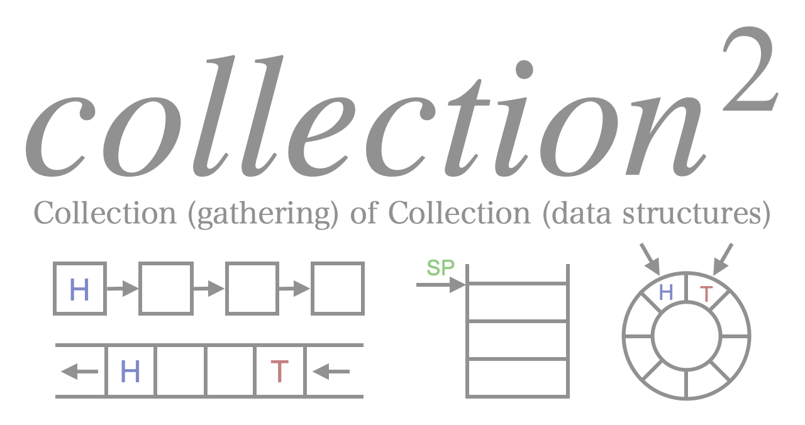

[](https://github.com/Enchan1207/collection2/actions/workflows/cmake.yml)

## Overview

Collection of common data structures

## Features

 - header-only library
 - designed for small embedded system
    - no dynamic memory allocation (`malloc`, `new`, ...)
    - no code depends on STL
 - 4 generic data structure
    - Queue
    - Stack
    - Buffer
    - List

## Install

You can install collection2 by some ways.

### 1. install as dependency of your project (using [FetchContent](https://cmake.org/cmake/help/latest/module/FetchContent.html) of CMake)

Add the following to your `CMakeLists.txt`:

```CMake
# Fetch library
include(FetchContent)
FetchContent_Declare(
    collection2
    GIT_REPOSITORY https://github.com/Enchan1207/collection2
    GIT_TAG v0.2.0
)
FetchContent_MakeAvailable(collection2)

# assume target name is main
add_executable(main)
target_sources(main
    ...
)

# Include directories are automatically set when linking
target_link_libraries(main PRIVATE
    collection2 
)
```

### 2. install to your client machine

After clone this repository, exec commands shown below. To exec these commands, the library will be installed on your system.

```
mkdir build
cd build
cmake ..
cmake --build .
ctest
cmake --install .
```

## Usage

Latest document is hosted on [GitHub Pages](https://enchan1207.github.io/collection2/).


## License

This repository is published under [MIT License](LICENSE).
